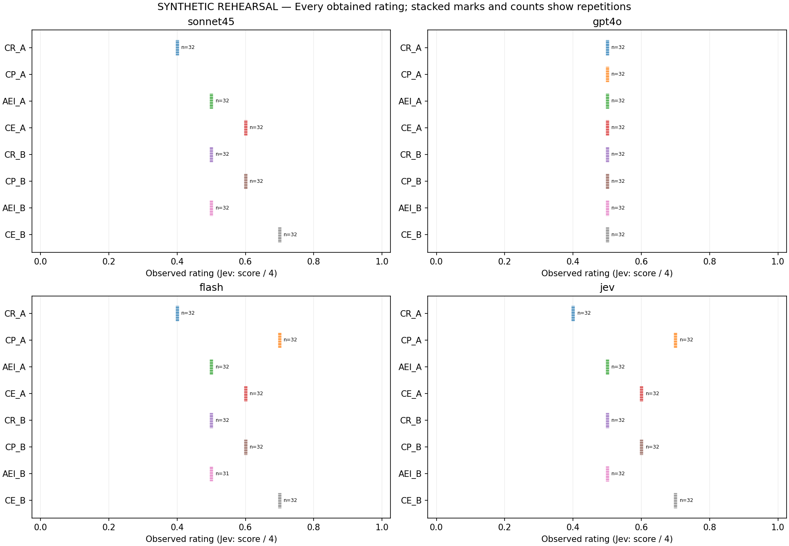
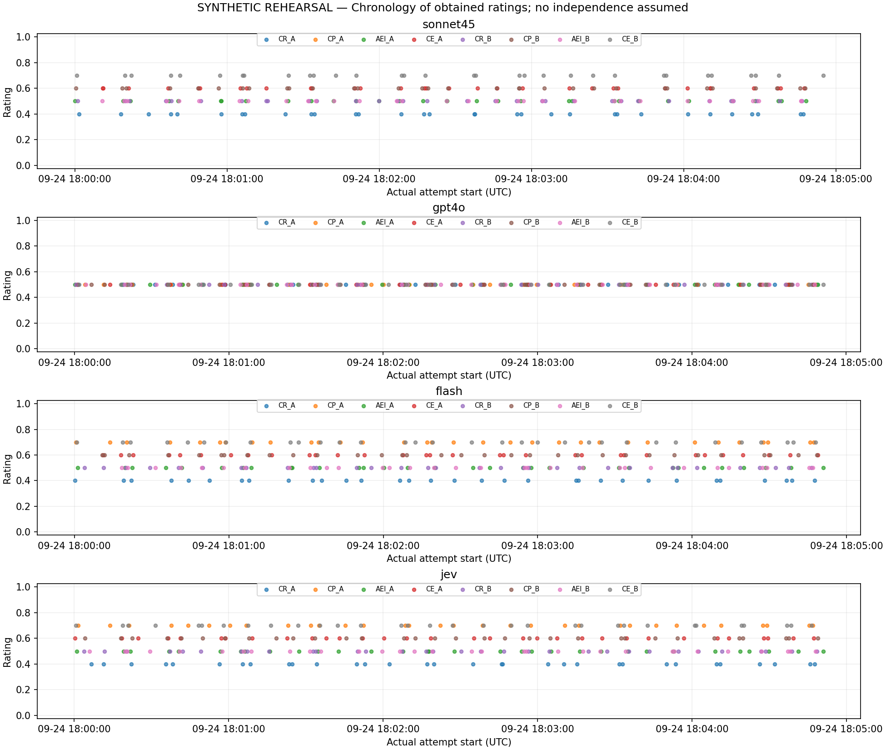

# SYNTHETIC REHEARSAL — NOT STUDY DATA

Status: complete.
Planned 1024; obtained 991; missing/pending 33; client attempts 1098.
Technical failed/uncertain attempts 8; unusable-rating attempts 99; flagged obtained ratings 1.
Planning cost EUR 0.814586; unknown-cost attempts 8; invoices not verified.

Each cell uses all and only its first usable slot ratings. Missing cells are NA. Unequal counts do not cause deletion of other cells. All exact frequencies, attempt histories and file hashes are in summary.json.
Reference 0.05 is descriptive and contestable. No p-values, confidence intervals or equivalence claims. Fixed planned halves are not independent replications. Jev uses a distinct rubric; its magnitudes must not be ranked directly against chat ratings.

## sonnet45

Returned identities: {"claude-sonnet-4-5-20250929": 224}.

|Cell|Planned|Obtained|First / second / third|Missing|Mean|Median|Min–max|Flags|
|---|---:|---:|---|---:|---:|---:|---|---:|
|CR_A|32|32|32 / 0 / 0|0|0.4|0.4|0.4 – 0.4|0|
|CP_A|32|0|0 / 0 / 0|32|NA (empty required cell)|NA (empty required cell)|NA (empty required cell) – NA (empty required cell)|0|
|AEI_A|32|32|32 / 0 / 0|0|0.5|0.5|0.5 – 0.5|0|
|CE_A|32|32|32 / 0 / 0|0|0.6|0.6|0.6 – 0.6|0|
|CR_B|32|32|32 / 0 / 0|0|0.5|0.5|0.5 – 0.5|0|
|CP_B|32|32|32 / 0 / 0|0|0.6|0.6|0.6 – 0.6|0|
|AEI_B|32|32|32 / 0 / 0|0|0.5|0.5|0.5 – 0.5|0|
|CE_B|32|32|32 / 0 / 0|0|0.7|0.7|0.7 – 0.7|0|

|Planned segment|Pair|Contrast on A|Contrast on B|Interaction|Relative to 0.05 (absolute)|
|---|---|---:|---:|---:|---|
|All|CP − CR|NA (empty required cell)|0.1|NA (empty required cell)|NA|
|All|CE − AEI|0.1|0.2|-0.1|above|
|[1, 16]|CP − CR|NA (empty required cell)|0.1|NA (empty required cell)|NA|
|[1, 16]|CE − AEI|0.1|0.2|-0.1|above|
|[17, 32]|CP − CR|NA (empty required cell)|0.1|NA (empty required cell)|NA|
|[17, 32]|CE − AEI|0.1|0.2|-0.1|above|

|Cell|Unobtained slot states|Failed attempt categories|Flags across attempts|
|---|---|---|---|
|CR_A|{}|{}|{}|
|CP_A|{"exhausted": 32}|{"missing_rating": 96}|{"schema_deviation": 96}|
|AEI_A|{}|{}|{}|
|CE_A|{}|{}|{}|
|CR_B|{}|{}|{}|
|CP_B|{}|{}|{}|
|AEI_B|{}|{}|{}|
|CE_B|{}|{}|{}|

## gpt4o

Returned identities: {"gpt-4o-2024-08-06": 256}.

|Cell|Planned|Obtained|First / second / third|Missing|Mean|Median|Min–max|Flags|
|---|---:|---:|---|---:|---:|---:|---|---:|
|CR_A|32|32|32 / 0 / 0|0|0.5|0.5|0.5 – 0.5|0|
|CP_A|32|32|32 / 0 / 0|0|0.5|0.5|0.5 – 0.5|0|
|AEI_A|32|32|32 / 0 / 0|0|0.5|0.5|0.5 – 0.5|0|
|CE_A|32|32|32 / 0 / 0|0|0.5|0.5|0.5 – 0.5|0|
|CR_B|32|32|32 / 0 / 0|0|0.5|0.5|0.5 – 0.5|0|
|CP_B|32|32|32 / 0 / 0|0|0.5|0.5|0.5 – 0.5|0|
|AEI_B|32|32|32 / 0 / 0|0|0.5|0.5|0.5 – 0.5|0|
|CE_B|32|32|32 / 0 / 0|0|0.5|0.5|0.5 – 0.5|0|

|Planned segment|Pair|Contrast on A|Contrast on B|Interaction|Relative to 0.05 (absolute)|
|---|---|---:|---:|---:|---|
|All|CP − CR|0|0|0|below|
|All|CE − AEI|0|0|0|below|
|[1, 16]|CP − CR|0|0|0|below|
|[1, 16]|CE − AEI|0|0|0|below|
|[17, 32]|CP − CR|0|0|0|below|
|[17, 32]|CE − AEI|0|0|0|below|

|Cell|Unobtained slot states|Failed attempt categories|Flags across attempts|
|---|---|---|---|
|CR_A|{}|{}|{}|
|CP_A|{}|{}|{}|
|AEI_A|{}|{}|{}|
|CE_A|{}|{}|{}|
|CR_B|{}|{}|{}|
|CP_B|{}|{}|{}|
|AEI_B|{}|{}|{}|
|CE_B|{}|{}|{}|

## flash

Returned identities: {"gemini-3.5-flash": 255}.

|Cell|Planned|Obtained|First / second / third|Missing|Mean|Median|Min–max|Flags|
|---|---:|---:|---|---:|---:|---:|---|---:|
|CR_A|32|32|32 / 0 / 0|0|0.4|0.4|0.4 – 0.4|0|
|CP_A|32|32|32 / 0 / 0|0|0.7|0.7|0.7 – 0.7|0|
|AEI_A|32|32|32 / 0 / 0|0|0.5|0.5|0.5 – 0.5|0|
|CE_A|32|32|32 / 0 / 0|0|0.6|0.6|0.6 – 0.6|0|
|CR_B|32|32|24 / 8 / 0|0|0.5|0.5|0.5 – 0.5|0|
|CP_B|32|32|32 / 0 / 0|0|0.6|0.6|0.6 – 0.6|0|
|AEI_B|32|31|31 / 0 / 0|1|0.5|0.5|0.5 – 0.5|0|
|CE_B|32|32|32 / 0 / 0|0|0.7|0.7|0.7 – 0.7|0|

|Planned segment|Pair|Contrast on A|Contrast on B|Interaction|Relative to 0.05 (absolute)|
|---|---|---:|---:|---:|---|
|All|CP − CR|0.3|0.1|0.2|above|
|All|CE − AEI|0.1|0.2|-0.1|above|
|[1, 16]|CP − CR|0.3|0.1|0.2|above|
|[1, 16]|CE − AEI|0.1|0.2|-0.1|above|
|[17, 32]|CP − CR|0.3|0.1|0.2|above|
|[17, 32]|CE − AEI|0.1|0.2|-0.1|above|

|Cell|Unobtained slot states|Failed attempt categories|Flags across attempts|
|---|---|---|---|
|CR_A|{}|{}|{}|
|CP_A|{}|{}|{}|
|AEI_A|{}|{}|{}|
|CE_A|{}|{}|{}|
|CR_B|{}|{"technical": 8}|{"transport_Timeout": 8}|
|CP_B|{}|{}|{}|
|AEI_B|{"exhausted": 1}|{"missing_rating": 3}|{"schema_deviation": 3}|
|CE_B|{}|{}|{}|

## jev

Returned identities: {"typesafe-ai/jev": 256}.

|Cell|Planned|Obtained|First / second / third|Missing|Mean|Median|Min–max|Flags|
|---|---:|---:|---|---:|---:|---:|---|---:|
|CR_A|32|32|32 / 0 / 0|0|0.4|0.4|0.4 – 0.4|0|
|CP_A|32|32|32 / 0 / 0|0|0.7|0.7|0.7 – 0.7|1|
|AEI_A|32|32|32 / 0 / 0|0|0.5|0.5|0.5 – 0.5|0|
|CE_A|32|32|32 / 0 / 0|0|0.6|0.6|0.6 – 0.6|0|
|CR_B|32|32|32 / 0 / 0|0|0.5|0.5|0.5 – 0.5|0|
|CP_B|32|32|32 / 0 / 0|0|0.6|0.6|0.6 – 0.6|0|
|AEI_B|32|32|32 / 0 / 0|0|0.5|0.5|0.5 – 0.5|0|
|CE_B|32|32|32 / 0 / 0|0|0.7|0.7|0.7 – 0.7|0|

|Planned segment|Pair|Contrast on A|Contrast on B|Interaction|Relative to 0.05 (absolute)|
|---|---|---:|---:|---:|---|
|All|CP − CR|0.3|0.1|0.2|above|
|All|CE − AEI|0.1|0.2|-0.1|above|
|[1, 16]|CP − CR|0.3|0.1|0.2|above|
|[1, 16]|CE − AEI|0.1|0.2|-0.1|above|
|[17, 32]|CP − CR|0.3|0.1|0.2|above|
|[17, 32]|CE − AEI|0.1|0.2|-0.1|above|

|Cell|Unobtained slot states|Failed attempt categories|Flags across attempts|
|---|---|---|---|
|CR_A|{}|{}|{}|
|CP_A|{}|{}|{"auxiliary_probabilities_invalid_or_missing": 1}|
|AEI_A|{}|{}|{}|
|CE_A|{}|{}|{}|
|CR_B|{}|{}|{}|
|CP_B|{}|{}|{}|
|AEI_B|{}|{}|{}|
|CE_B|{}|{}|{}|

## Plots

## Missingness and operational limits

Failures, missing scores and successful recoveries are retained by slot and by attempt in summary.json. The selected ratings can be affected by this acquisition procedure. Date/model changes and missing scores are not silently repaired.

## Illustrative responses

The first usable response in planned sequence for each cell appears in illustrations.json, with slot, attempt and version. These examples were not selected by effect size or rhetorical appeal. Other responses remain in the private raw archive.
