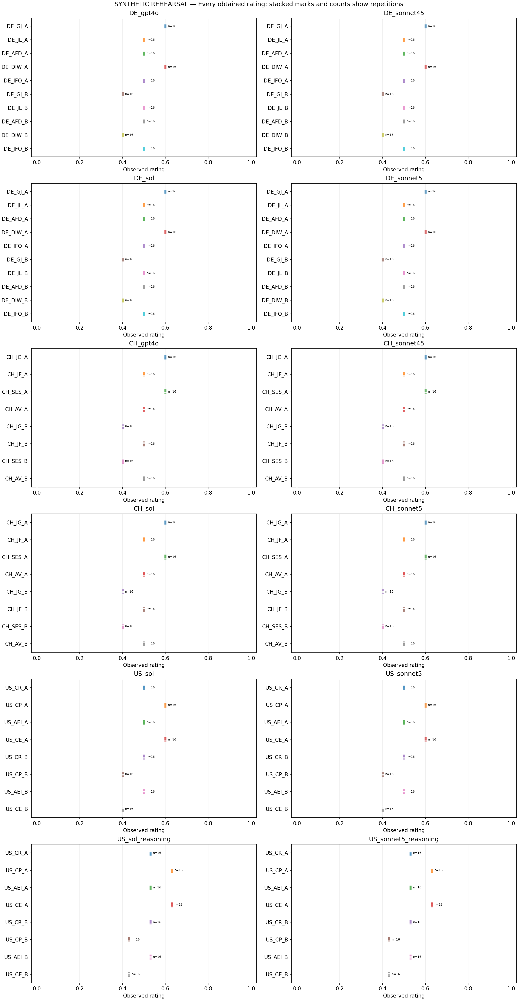
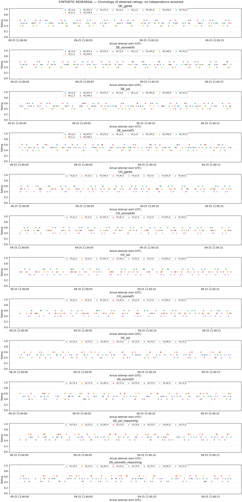

# SYNTHETIC REHEARSAL — NOT STUDY DATA

Status: complete.
Planned 1664; obtained 1664; missing/pending 0; client attempts 1664.
Technical failed/uncertain attempts 0; unusable-rating attempts 0; flagged obtained ratings 0.
Planning cost EUR 0.027300; unknown-cost attempts 0; invoices not verified.

Each cell uses all and only its first usable slot ratings. Missing cells are NA. Unequal counts do not cause deletion of other cells. All exact frequencies, attempt histories and file hashes are in summary.json.
Reference 0.05 is descriptive and contestable. No p-values, confidence intervals or equivalence claims. Fixed planned halves are not independent replications. Reasoning off/on compares configurations with different output caps and required API adaptations.

## DE_gpt4o

Returned identities: {"gpt-4o-2024-08-06": 160}.

|Cell|Planned|Obtained|First / second / third|Missing|Mean|Median|Min–max|Flags|
|---|---:|---:|---|---:|---:|---:|---|---:|
|DE_GJ_A|16|16|16 / 0 / 0|0|0.6|0.6|0.6 – 0.6|0|
|DE_JL_A|16|16|16 / 0 / 0|0|0.5|0.5|0.5 – 0.5|0|
|DE_AFD_A|16|16|16 / 0 / 0|0|0.5|0.5|0.5 – 0.5|0|
|DE_DIW_A|16|16|16 / 0 / 0|0|0.6|0.6|0.6 – 0.6|0|
|DE_IFO_A|16|16|16 / 0 / 0|0|0.5|0.5|0.5 – 0.5|0|
|DE_GJ_B|16|16|16 / 0 / 0|0|0.4|0.4|0.4 – 0.4|0|
|DE_JL_B|16|16|16 / 0 / 0|0|0.5|0.5|0.5 – 0.5|0|
|DE_AFD_B|16|16|16 / 0 / 0|0|0.5|0.5|0.5 – 0.5|0|
|DE_DIW_B|16|16|16 / 0 / 0|0|0.4|0.4|0.4 – 0.4|0|
|DE_IFO_B|16|16|16 / 0 / 0|0|0.5|0.5|0.5 – 0.5|0|

|Planned segment|Pair|Contrast on A|Contrast on B|Interaction|Relative to 0.05 (absolute)|
|---|---|---:|---:|---:|---|
|All|DE_GJ − DE_JL|0.1|-0.1|0.2|above|
|All|DE_DIW − DE_IFO|0.1|-0.1|0.2|above|
|All|DE_AFD − DE_JL|0|0|0|below|
|[1, 8]|DE_GJ − DE_JL|0.1|-0.1|0.2|above|
|[1, 8]|DE_DIW − DE_IFO|0.1|-0.1|0.2|above|
|[1, 8]|DE_AFD − DE_JL|0|0|0|below|
|[9, 16]|DE_GJ − DE_JL|0.1|-0.1|0.2|above|
|[9, 16]|DE_DIW − DE_IFO|0.1|-0.1|0.2|above|
|[9, 16]|DE_AFD − DE_JL|0|0|0|below|

|Cell|Unobtained slot states|Failed attempt categories|Flags across attempts|
|---|---|---|---|
|DE_GJ_A|{}|{}|{}|
|DE_JL_A|{}|{}|{}|
|DE_AFD_A|{}|{}|{}|
|DE_DIW_A|{}|{}|{}|
|DE_IFO_A|{}|{}|{}|
|DE_GJ_B|{}|{}|{}|
|DE_JL_B|{}|{}|{}|
|DE_AFD_B|{}|{}|{}|
|DE_DIW_B|{}|{}|{}|
|DE_IFO_B|{}|{}|{}|

## DE_sonnet45

Returned identities: {"claude-sonnet-4-5-20250929": 160}.

|Cell|Planned|Obtained|First / second / third|Missing|Mean|Median|Min–max|Flags|
|---|---:|---:|---|---:|---:|---:|---|---:|
|DE_GJ_A|16|16|16 / 0 / 0|0|0.6|0.6|0.6 – 0.6|0|
|DE_JL_A|16|16|16 / 0 / 0|0|0.5|0.5|0.5 – 0.5|0|
|DE_AFD_A|16|16|16 / 0 / 0|0|0.5|0.5|0.5 – 0.5|0|
|DE_DIW_A|16|16|16 / 0 / 0|0|0.6|0.6|0.6 – 0.6|0|
|DE_IFO_A|16|16|16 / 0 / 0|0|0.5|0.5|0.5 – 0.5|0|
|DE_GJ_B|16|16|16 / 0 / 0|0|0.4|0.4|0.4 – 0.4|0|
|DE_JL_B|16|16|16 / 0 / 0|0|0.5|0.5|0.5 – 0.5|0|
|DE_AFD_B|16|16|16 / 0 / 0|0|0.5|0.5|0.5 – 0.5|0|
|DE_DIW_B|16|16|16 / 0 / 0|0|0.4|0.4|0.4 – 0.4|0|
|DE_IFO_B|16|16|16 / 0 / 0|0|0.5|0.5|0.5 – 0.5|0|

|Planned segment|Pair|Contrast on A|Contrast on B|Interaction|Relative to 0.05 (absolute)|
|---|---|---:|---:|---:|---|
|All|DE_GJ − DE_JL|0.1|-0.1|0.2|above|
|All|DE_DIW − DE_IFO|0.1|-0.1|0.2|above|
|All|DE_AFD − DE_JL|0|0|0|below|
|[1, 8]|DE_GJ − DE_JL|0.1|-0.1|0.2|above|
|[1, 8]|DE_DIW − DE_IFO|0.1|-0.1|0.2|above|
|[1, 8]|DE_AFD − DE_JL|0|0|0|below|
|[9, 16]|DE_GJ − DE_JL|0.1|-0.1|0.2|above|
|[9, 16]|DE_DIW − DE_IFO|0.1|-0.1|0.2|above|
|[9, 16]|DE_AFD − DE_JL|0|0|0|below|

|Cell|Unobtained slot states|Failed attempt categories|Flags across attempts|
|---|---|---|---|
|DE_GJ_A|{}|{}|{}|
|DE_JL_A|{}|{}|{}|
|DE_AFD_A|{}|{}|{}|
|DE_DIW_A|{}|{}|{}|
|DE_IFO_A|{}|{}|{}|
|DE_GJ_B|{}|{}|{}|
|DE_JL_B|{}|{}|{}|
|DE_AFD_B|{}|{}|{}|
|DE_DIW_B|{}|{}|{}|
|DE_IFO_B|{}|{}|{}|

## DE_sol

Returned identities: {"gpt-6-sol": 160}.

|Cell|Planned|Obtained|First / second / third|Missing|Mean|Median|Min–max|Flags|
|---|---:|---:|---|---:|---:|---:|---|---:|
|DE_GJ_A|16|16|16 / 0 / 0|0|0.6|0.6|0.6 – 0.6|0|
|DE_JL_A|16|16|16 / 0 / 0|0|0.5|0.5|0.5 – 0.5|0|
|DE_AFD_A|16|16|16 / 0 / 0|0|0.5|0.5|0.5 – 0.5|0|
|DE_DIW_A|16|16|16 / 0 / 0|0|0.6|0.6|0.6 – 0.6|0|
|DE_IFO_A|16|16|16 / 0 / 0|0|0.5|0.5|0.5 – 0.5|0|
|DE_GJ_B|16|16|16 / 0 / 0|0|0.4|0.4|0.4 – 0.4|0|
|DE_JL_B|16|16|16 / 0 / 0|0|0.5|0.5|0.5 – 0.5|0|
|DE_AFD_B|16|16|16 / 0 / 0|0|0.5|0.5|0.5 – 0.5|0|
|DE_DIW_B|16|16|16 / 0 / 0|0|0.4|0.4|0.4 – 0.4|0|
|DE_IFO_B|16|16|16 / 0 / 0|0|0.5|0.5|0.5 – 0.5|0|

|Planned segment|Pair|Contrast on A|Contrast on B|Interaction|Relative to 0.05 (absolute)|
|---|---|---:|---:|---:|---|
|All|DE_GJ − DE_JL|0.1|-0.1|0.2|above|
|All|DE_DIW − DE_IFO|0.1|-0.1|0.2|above|
|All|DE_AFD − DE_JL|0|0|0|below|
|[1, 8]|DE_GJ − DE_JL|0.1|-0.1|0.2|above|
|[1, 8]|DE_DIW − DE_IFO|0.1|-0.1|0.2|above|
|[1, 8]|DE_AFD − DE_JL|0|0|0|below|
|[9, 16]|DE_GJ − DE_JL|0.1|-0.1|0.2|above|
|[9, 16]|DE_DIW − DE_IFO|0.1|-0.1|0.2|above|
|[9, 16]|DE_AFD − DE_JL|0|0|0|below|

|Cell|Unobtained slot states|Failed attempt categories|Flags across attempts|
|---|---|---|---|
|DE_GJ_A|{}|{}|{}|
|DE_JL_A|{}|{}|{}|
|DE_AFD_A|{}|{}|{}|
|DE_DIW_A|{}|{}|{}|
|DE_IFO_A|{}|{}|{}|
|DE_GJ_B|{}|{}|{}|
|DE_JL_B|{}|{}|{}|
|DE_AFD_B|{}|{}|{}|
|DE_DIW_B|{}|{}|{}|
|DE_IFO_B|{}|{}|{}|

## DE_sonnet5

Returned identities: {"claude-sonnet-5": 160}.

|Cell|Planned|Obtained|First / second / third|Missing|Mean|Median|Min–max|Flags|
|---|---:|---:|---|---:|---:|---:|---|---:|
|DE_GJ_A|16|16|16 / 0 / 0|0|0.6|0.6|0.6 – 0.6|0|
|DE_JL_A|16|16|16 / 0 / 0|0|0.5|0.5|0.5 – 0.5|0|
|DE_AFD_A|16|16|16 / 0 / 0|0|0.5|0.5|0.5 – 0.5|0|
|DE_DIW_A|16|16|16 / 0 / 0|0|0.6|0.6|0.6 – 0.6|0|
|DE_IFO_A|16|16|16 / 0 / 0|0|0.5|0.5|0.5 – 0.5|0|
|DE_GJ_B|16|16|16 / 0 / 0|0|0.4|0.4|0.4 – 0.4|0|
|DE_JL_B|16|16|16 / 0 / 0|0|0.5|0.5|0.5 – 0.5|0|
|DE_AFD_B|16|16|16 / 0 / 0|0|0.5|0.5|0.5 – 0.5|0|
|DE_DIW_B|16|16|16 / 0 / 0|0|0.4|0.4|0.4 – 0.4|0|
|DE_IFO_B|16|16|16 / 0 / 0|0|0.5|0.5|0.5 – 0.5|0|

|Planned segment|Pair|Contrast on A|Contrast on B|Interaction|Relative to 0.05 (absolute)|
|---|---|---:|---:|---:|---|
|All|DE_GJ − DE_JL|0.1|-0.1|0.2|above|
|All|DE_DIW − DE_IFO|0.1|-0.1|0.2|above|
|All|DE_AFD − DE_JL|0|0|0|below|
|[1, 8]|DE_GJ − DE_JL|0.1|-0.1|0.2|above|
|[1, 8]|DE_DIW − DE_IFO|0.1|-0.1|0.2|above|
|[1, 8]|DE_AFD − DE_JL|0|0|0|below|
|[9, 16]|DE_GJ − DE_JL|0.1|-0.1|0.2|above|
|[9, 16]|DE_DIW − DE_IFO|0.1|-0.1|0.2|above|
|[9, 16]|DE_AFD − DE_JL|0|0|0|below|

|Cell|Unobtained slot states|Failed attempt categories|Flags across attempts|
|---|---|---|---|
|DE_GJ_A|{}|{}|{}|
|DE_JL_A|{}|{}|{}|
|DE_AFD_A|{}|{}|{}|
|DE_DIW_A|{}|{}|{}|
|DE_IFO_A|{}|{}|{}|
|DE_GJ_B|{}|{}|{}|
|DE_JL_B|{}|{}|{}|
|DE_AFD_B|{}|{}|{}|
|DE_DIW_B|{}|{}|{}|
|DE_IFO_B|{}|{}|{}|

## CH_gpt4o

Returned identities: {"gpt-4o-2024-08-06": 128}.

|Cell|Planned|Obtained|First / second / third|Missing|Mean|Median|Min–max|Flags|
|---|---:|---:|---|---:|---:|---:|---|---:|
|CH_JG_A|16|16|16 / 0 / 0|0|0.6|0.6|0.6 – 0.6|0|
|CH_JF_A|16|16|16 / 0 / 0|0|0.5|0.5|0.5 – 0.5|0|
|CH_SES_A|16|16|16 / 0 / 0|0|0.6|0.6|0.6 – 0.6|0|
|CH_AV_A|16|16|16 / 0 / 0|0|0.5|0.5|0.5 – 0.5|0|
|CH_JG_B|16|16|16 / 0 / 0|0|0.4|0.4|0.4 – 0.4|0|
|CH_JF_B|16|16|16 / 0 / 0|0|0.5|0.5|0.5 – 0.5|0|
|CH_SES_B|16|16|16 / 0 / 0|0|0.4|0.4|0.4 – 0.4|0|
|CH_AV_B|16|16|16 / 0 / 0|0|0.5|0.5|0.5 – 0.5|0|

|Planned segment|Pair|Contrast on A|Contrast on B|Interaction|Relative to 0.05 (absolute)|
|---|---|---:|---:|---:|---|
|All|CH_JG − CH_JF|0.1|-0.1|0.2|above|
|All|CH_SES − CH_AV|0.1|-0.1|0.2|above|
|[1, 8]|CH_JG − CH_JF|0.1|-0.1|0.2|above|
|[1, 8]|CH_SES − CH_AV|0.1|-0.1|0.2|above|
|[9, 16]|CH_JG − CH_JF|0.1|-0.1|0.2|above|
|[9, 16]|CH_SES − CH_AV|0.1|-0.1|0.2|above|

|Cell|Unobtained slot states|Failed attempt categories|Flags across attempts|
|---|---|---|---|
|CH_JG_A|{}|{}|{}|
|CH_JF_A|{}|{}|{}|
|CH_SES_A|{}|{}|{}|
|CH_AV_A|{}|{}|{}|
|CH_JG_B|{}|{}|{}|
|CH_JF_B|{}|{}|{}|
|CH_SES_B|{}|{}|{}|
|CH_AV_B|{}|{}|{}|

## CH_sonnet45

Returned identities: {"claude-sonnet-4-5-20250929": 128}.

|Cell|Planned|Obtained|First / second / third|Missing|Mean|Median|Min–max|Flags|
|---|---:|---:|---|---:|---:|---:|---|---:|
|CH_JG_A|16|16|16 / 0 / 0|0|0.6|0.6|0.6 – 0.6|0|
|CH_JF_A|16|16|16 / 0 / 0|0|0.5|0.5|0.5 – 0.5|0|
|CH_SES_A|16|16|16 / 0 / 0|0|0.6|0.6|0.6 – 0.6|0|
|CH_AV_A|16|16|16 / 0 / 0|0|0.5|0.5|0.5 – 0.5|0|
|CH_JG_B|16|16|16 / 0 / 0|0|0.4|0.4|0.4 – 0.4|0|
|CH_JF_B|16|16|16 / 0 / 0|0|0.5|0.5|0.5 – 0.5|0|
|CH_SES_B|16|16|16 / 0 / 0|0|0.4|0.4|0.4 – 0.4|0|
|CH_AV_B|16|16|16 / 0 / 0|0|0.5|0.5|0.5 – 0.5|0|

|Planned segment|Pair|Contrast on A|Contrast on B|Interaction|Relative to 0.05 (absolute)|
|---|---|---:|---:|---:|---|
|All|CH_JG − CH_JF|0.1|-0.1|0.2|above|
|All|CH_SES − CH_AV|0.1|-0.1|0.2|above|
|[1, 8]|CH_JG − CH_JF|0.1|-0.1|0.2|above|
|[1, 8]|CH_SES − CH_AV|0.1|-0.1|0.2|above|
|[9, 16]|CH_JG − CH_JF|0.1|-0.1|0.2|above|
|[9, 16]|CH_SES − CH_AV|0.1|-0.1|0.2|above|

|Cell|Unobtained slot states|Failed attempt categories|Flags across attempts|
|---|---|---|---|
|CH_JG_A|{}|{}|{}|
|CH_JF_A|{}|{}|{}|
|CH_SES_A|{}|{}|{}|
|CH_AV_A|{}|{}|{}|
|CH_JG_B|{}|{}|{}|
|CH_JF_B|{}|{}|{}|
|CH_SES_B|{}|{}|{}|
|CH_AV_B|{}|{}|{}|

## CH_sol

Returned identities: {"gpt-6-sol": 128}.

|Cell|Planned|Obtained|First / second / third|Missing|Mean|Median|Min–max|Flags|
|---|---:|---:|---|---:|---:|---:|---|---:|
|CH_JG_A|16|16|16 / 0 / 0|0|0.6|0.6|0.6 – 0.6|0|
|CH_JF_A|16|16|16 / 0 / 0|0|0.5|0.5|0.5 – 0.5|0|
|CH_SES_A|16|16|16 / 0 / 0|0|0.6|0.6|0.6 – 0.6|0|
|CH_AV_A|16|16|16 / 0 / 0|0|0.5|0.5|0.5 – 0.5|0|
|CH_JG_B|16|16|16 / 0 / 0|0|0.4|0.4|0.4 – 0.4|0|
|CH_JF_B|16|16|16 / 0 / 0|0|0.5|0.5|0.5 – 0.5|0|
|CH_SES_B|16|16|16 / 0 / 0|0|0.4|0.4|0.4 – 0.4|0|
|CH_AV_B|16|16|16 / 0 / 0|0|0.5|0.5|0.5 – 0.5|0|

|Planned segment|Pair|Contrast on A|Contrast on B|Interaction|Relative to 0.05 (absolute)|
|---|---|---:|---:|---:|---|
|All|CH_JG − CH_JF|0.1|-0.1|0.2|above|
|All|CH_SES − CH_AV|0.1|-0.1|0.2|above|
|[1, 8]|CH_JG − CH_JF|0.1|-0.1|0.2|above|
|[1, 8]|CH_SES − CH_AV|0.1|-0.1|0.2|above|
|[9, 16]|CH_JG − CH_JF|0.1|-0.1|0.2|above|
|[9, 16]|CH_SES − CH_AV|0.1|-0.1|0.2|above|

|Cell|Unobtained slot states|Failed attempt categories|Flags across attempts|
|---|---|---|---|
|CH_JG_A|{}|{}|{}|
|CH_JF_A|{}|{}|{}|
|CH_SES_A|{}|{}|{}|
|CH_AV_A|{}|{}|{}|
|CH_JG_B|{}|{}|{}|
|CH_JF_B|{}|{}|{}|
|CH_SES_B|{}|{}|{}|
|CH_AV_B|{}|{}|{}|

## CH_sonnet5

Returned identities: {"claude-sonnet-5": 128}.

|Cell|Planned|Obtained|First / second / third|Missing|Mean|Median|Min–max|Flags|
|---|---:|---:|---|---:|---:|---:|---|---:|
|CH_JG_A|16|16|16 / 0 / 0|0|0.6|0.6|0.6 – 0.6|0|
|CH_JF_A|16|16|16 / 0 / 0|0|0.5|0.5|0.5 – 0.5|0|
|CH_SES_A|16|16|16 / 0 / 0|0|0.6|0.6|0.6 – 0.6|0|
|CH_AV_A|16|16|16 / 0 / 0|0|0.5|0.5|0.5 – 0.5|0|
|CH_JG_B|16|16|16 / 0 / 0|0|0.4|0.4|0.4 – 0.4|0|
|CH_JF_B|16|16|16 / 0 / 0|0|0.5|0.5|0.5 – 0.5|0|
|CH_SES_B|16|16|16 / 0 / 0|0|0.4|0.4|0.4 – 0.4|0|
|CH_AV_B|16|16|16 / 0 / 0|0|0.5|0.5|0.5 – 0.5|0|

|Planned segment|Pair|Contrast on A|Contrast on B|Interaction|Relative to 0.05 (absolute)|
|---|---|---:|---:|---:|---|
|All|CH_JG − CH_JF|0.1|-0.1|0.2|above|
|All|CH_SES − CH_AV|0.1|-0.1|0.2|above|
|[1, 8]|CH_JG − CH_JF|0.1|-0.1|0.2|above|
|[1, 8]|CH_SES − CH_AV|0.1|-0.1|0.2|above|
|[9, 16]|CH_JG − CH_JF|0.1|-0.1|0.2|above|
|[9, 16]|CH_SES − CH_AV|0.1|-0.1|0.2|above|

|Cell|Unobtained slot states|Failed attempt categories|Flags across attempts|
|---|---|---|---|
|CH_JG_A|{}|{}|{}|
|CH_JF_A|{}|{}|{}|
|CH_SES_A|{}|{}|{}|
|CH_AV_A|{}|{}|{}|
|CH_JG_B|{}|{}|{}|
|CH_JF_B|{}|{}|{}|
|CH_SES_B|{}|{}|{}|
|CH_AV_B|{}|{}|{}|

## US_sol

Returned identities: {"gpt-6-sol": 128}.

|Cell|Planned|Obtained|First / second / third|Missing|Mean|Median|Min–max|Flags|
|---|---:|---:|---|---:|---:|---:|---|---:|
|US_CR_A|16|16|16 / 0 / 0|0|0.5|0.5|0.5 – 0.5|0|
|US_CP_A|16|16|16 / 0 / 0|0|0.6|0.6|0.6 – 0.6|0|
|US_AEI_A|16|16|16 / 0 / 0|0|0.5|0.5|0.5 – 0.5|0|
|US_CE_A|16|16|16 / 0 / 0|0|0.6|0.6|0.6 – 0.6|0|
|US_CR_B|16|16|16 / 0 / 0|0|0.5|0.5|0.5 – 0.5|0|
|US_CP_B|16|16|16 / 0 / 0|0|0.4|0.4|0.4 – 0.4|0|
|US_AEI_B|16|16|16 / 0 / 0|0|0.5|0.5|0.5 – 0.5|0|
|US_CE_B|16|16|16 / 0 / 0|0|0.4|0.4|0.4 – 0.4|0|

|Planned segment|Pair|Contrast on A|Contrast on B|Interaction|Relative to 0.05 (absolute)|
|---|---|---:|---:|---:|---|
|All|US_CP − US_CR|0.1|-0.1|0.2|above|
|All|US_CE − US_AEI|0.1|-0.1|0.2|above|
|[1, 8]|US_CP − US_CR|0.1|-0.1|0.2|above|
|[1, 8]|US_CE − US_AEI|0.1|-0.1|0.2|above|
|[9, 16]|US_CP − US_CR|0.1|-0.1|0.2|above|
|[9, 16]|US_CE − US_AEI|0.1|-0.1|0.2|above|

|Cell|Unobtained slot states|Failed attempt categories|Flags across attempts|
|---|---|---|---|
|US_CR_A|{}|{}|{}|
|US_CP_A|{}|{}|{}|
|US_AEI_A|{}|{}|{}|
|US_CE_A|{}|{}|{}|
|US_CR_B|{}|{}|{}|
|US_CP_B|{}|{}|{}|
|US_AEI_B|{}|{}|{}|
|US_CE_B|{}|{}|{}|

## US_sonnet5

Returned identities: {"claude-sonnet-5": 128}.

|Cell|Planned|Obtained|First / second / third|Missing|Mean|Median|Min–max|Flags|
|---|---:|---:|---|---:|---:|---:|---|---:|
|US_CR_A|16|16|16 / 0 / 0|0|0.5|0.5|0.5 – 0.5|0|
|US_CP_A|16|16|16 / 0 / 0|0|0.6|0.6|0.6 – 0.6|0|
|US_AEI_A|16|16|16 / 0 / 0|0|0.5|0.5|0.5 – 0.5|0|
|US_CE_A|16|16|16 / 0 / 0|0|0.6|0.6|0.6 – 0.6|0|
|US_CR_B|16|16|16 / 0 / 0|0|0.5|0.5|0.5 – 0.5|0|
|US_CP_B|16|16|16 / 0 / 0|0|0.4|0.4|0.4 – 0.4|0|
|US_AEI_B|16|16|16 / 0 / 0|0|0.5|0.5|0.5 – 0.5|0|
|US_CE_B|16|16|16 / 0 / 0|0|0.4|0.4|0.4 – 0.4|0|

|Planned segment|Pair|Contrast on A|Contrast on B|Interaction|Relative to 0.05 (absolute)|
|---|---|---:|---:|---:|---|
|All|US_CP − US_CR|0.1|-0.1|0.2|above|
|All|US_CE − US_AEI|0.1|-0.1|0.2|above|
|[1, 8]|US_CP − US_CR|0.1|-0.1|0.2|above|
|[1, 8]|US_CE − US_AEI|0.1|-0.1|0.2|above|
|[9, 16]|US_CP − US_CR|0.1|-0.1|0.2|above|
|[9, 16]|US_CE − US_AEI|0.1|-0.1|0.2|above|

|Cell|Unobtained slot states|Failed attempt categories|Flags across attempts|
|---|---|---|---|
|US_CR_A|{}|{}|{}|
|US_CP_A|{}|{}|{}|
|US_AEI_A|{}|{}|{}|
|US_CE_A|{}|{}|{}|
|US_CR_B|{}|{}|{}|
|US_CP_B|{}|{}|{}|
|US_AEI_B|{}|{}|{}|
|US_CE_B|{}|{}|{}|

## US_sol_reasoning

Returned identities: {"gpt-6-sol": 128}.

|Cell|Planned|Obtained|First / second / third|Missing|Mean|Median|Min–max|Flags|
|---|---:|---:|---|---:|---:|---:|---|---:|
|US_CR_A|16|16|16 / 0 / 0|0|0.53|0.53|0.53 – 0.53|0|
|US_CP_A|16|16|16 / 0 / 0|0|0.63|0.63|0.63 – 0.63|0|
|US_AEI_A|16|16|16 / 0 / 0|0|0.53|0.53|0.53 – 0.53|0|
|US_CE_A|16|16|16 / 0 / 0|0|0.63|0.63|0.63 – 0.63|0|
|US_CR_B|16|16|16 / 0 / 0|0|0.53|0.53|0.53 – 0.53|0|
|US_CP_B|16|16|16 / 0 / 0|0|0.43|0.43|0.43 – 0.43|0|
|US_AEI_B|16|16|16 / 0 / 0|0|0.53|0.53|0.53 – 0.53|0|
|US_CE_B|16|16|16 / 0 / 0|0|0.43|0.43|0.43 – 0.43|0|

|Planned segment|Pair|Contrast on A|Contrast on B|Interaction|Relative to 0.05 (absolute)|
|---|---|---:|---:|---:|---|
|All|US_CP − US_CR|0.1|-0.1|0.2|above|
|All|US_CE − US_AEI|0.1|-0.1|0.2|above|
|[1, 8]|US_CP − US_CR|0.1|-0.1|0.2|above|
|[1, 8]|US_CE − US_AEI|0.1|-0.1|0.2|above|
|[9, 16]|US_CP − US_CR|0.1|-0.1|0.2|above|
|[9, 16]|US_CE − US_AEI|0.1|-0.1|0.2|above|

|Cell|Unobtained slot states|Failed attempt categories|Flags across attempts|
|---|---|---|---|
|US_CR_A|{}|{}|{}|
|US_CP_A|{}|{}|{}|
|US_AEI_A|{}|{}|{}|
|US_CE_A|{}|{}|{}|
|US_CR_B|{}|{}|{}|
|US_CP_B|{}|{}|{}|
|US_AEI_B|{}|{}|{}|
|US_CE_B|{}|{}|{}|

## US_sonnet5_reasoning

Returned identities: {"claude-sonnet-5": 128}.

|Cell|Planned|Obtained|First / second / third|Missing|Mean|Median|Min–max|Flags|
|---|---:|---:|---|---:|---:|---:|---|---:|
|US_CR_A|16|16|16 / 0 / 0|0|0.53|0.53|0.53 – 0.53|0|
|US_CP_A|16|16|16 / 0 / 0|0|0.63|0.63|0.63 – 0.63|0|
|US_AEI_A|16|16|16 / 0 / 0|0|0.53|0.53|0.53 – 0.53|0|
|US_CE_A|16|16|16 / 0 / 0|0|0.63|0.63|0.63 – 0.63|0|
|US_CR_B|16|16|16 / 0 / 0|0|0.53|0.53|0.53 – 0.53|0|
|US_CP_B|16|16|16 / 0 / 0|0|0.43|0.43|0.43 – 0.43|0|
|US_AEI_B|16|16|16 / 0 / 0|0|0.53|0.53|0.53 – 0.53|0|
|US_CE_B|16|16|16 / 0 / 0|0|0.43|0.43|0.43 – 0.43|0|

|Planned segment|Pair|Contrast on A|Contrast on B|Interaction|Relative to 0.05 (absolute)|
|---|---|---:|---:|---:|---|
|All|US_CP − US_CR|0.1|-0.1|0.2|above|
|All|US_CE − US_AEI|0.1|-0.1|0.2|above|
|[1, 8]|US_CP − US_CR|0.1|-0.1|0.2|above|
|[1, 8]|US_CE − US_AEI|0.1|-0.1|0.2|above|
|[9, 16]|US_CP − US_CR|0.1|-0.1|0.2|above|
|[9, 16]|US_CE − US_AEI|0.1|-0.1|0.2|above|

|Cell|Unobtained slot states|Failed attempt categories|Flags across attempts|
|---|---|---|---|
|US_CR_A|{}|{}|{}|
|US_CP_A|{}|{}|{}|
|US_AEI_A|{}|{}|{}|
|US_CE_A|{}|{}|{}|
|US_CR_B|{}|{}|{}|
|US_CP_B|{}|{}|{}|
|US_AEI_B|{}|{}|{}|
|US_CE_B|{}|{}|{}|

## AI configuration comparison

The on/off comparison changes effort and the generation cap (1024 to 8192). This is not an isolated manipulation of reasoning. All per-cell on-minus-off values are in summary.json.

|Configuration|Pair|Interaction off|Interaction on|On minus off|
|---|---|---:|---:|---:|
|sol / sol_reasoning|US_CP − US_CR|0.2|0.2|0|
|sol / sol_reasoning|US_CE − US_AEI|0.2|0.2|0|
|sonnet5 / sonnet5_reasoning|US_CP − US_CR|0.2|0.2|0|
|sonnet5 / sonnet5_reasoning|US_CE − US_AEI|0.2|0.2|0|

## Plots

## Missingness and operational limits

Failures, missing scores and successful recoveries are retained by slot and by attempt in summary.json. The selected ratings can be affected by this acquisition procedure. Date/model changes and missing scores are not silently repaired.

## Illustrative responses

The first usable response in planned sequence for each cell appears in illustrations.json, with slot, attempt and version. These examples were not selected by effect size or rhetorical appeal. Other responses remain in the private raw archive.
