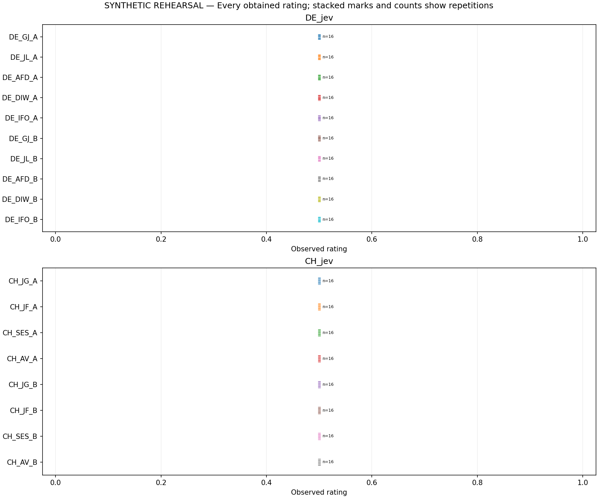
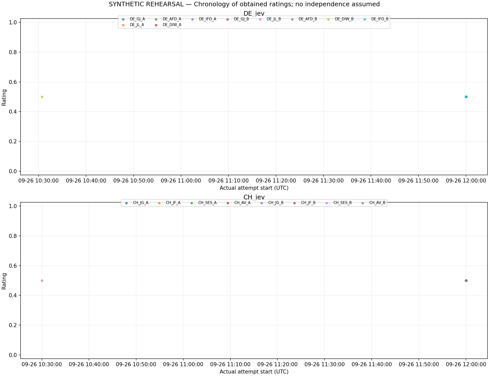

# SYNTHETIC REHEARSAL — NOT STUDY DATA

Status: complete.
Planned 288; obtained 288; missing/pending 0; client attempts 343.
Technical failed/uncertain attempts 55; unusable-rating attempts 0; flagged obtained ratings 0.
Planning cost EUR 0.586000; unknown-cost attempts 55; invoices not verified.

Each cell uses all and only its first usable slot ratings. Missing cells are NA. Unequal counts do not cause deletion of other cells. All exact frequencies, attempt histories and file hashes are in summary.json.
Reference 0.05 is descriptive and contestable. No p-values, confidence intervals or equivalence claims. Fixed planned halves are not independent replications. Jev uses the original US five-anchor rubric and native structured API; score / 4 is not calibration to chat ratings. This prospective supplement was planned after prior study outcomes were known.

## Prospective operational amendment

Original registration: https://github.com/MicheleLoi/Petri_studies/releases/tag/preregistered-source-attribution-jev-europe-descriptive-v1 (2026-09-26T10:24:02Z).
Recovery registration: SYNTHETIC AMENDMENT (2026-09-26T11:00:00+00:00).

All 57 original attempts, including 55 HTTP 429 responses, are preserved. Two obtained scores were never resent. Exactly eighteen previously exhausted slots received up to three additional attempts (six in total); every other slot retained its original cap of three. The amended collector stops globally on any new HTTP 429 and requires a separate explicit dated release.

Attempts by phase: {"original": 57, "repair": 286}. Obtained slots by phase: {"original": 2, "repair": 286}.
The intervention interrupted actual collection time and allowed selective recovery based on operational failure. Planned block assignments and halves are preserved but are not uninterrupted temporal segments or independent replications. The chronology plot uses actual timestamps; prefix integrity and publication before every permitted new attempt were checked.

## DE_jev

Returned identities: {"typesafe-ai/jev": 160}.

|Cell|Planned|Obtained|Attempts 1 / 2 / 3 / 4 / 5 / 6|Missing|Mean|Median|Min–max|Flags|
|---|---:|---:|---|---:|---:|---:|---|---:|
|DE_GJ_A|16|16|15 / 0 / 0 / 1 / 0 / 0|0|0.5|0.5|0.5 – 0.5|0|
|DE_JL_A|16|16|15 / 0 / 0 / 1 / 0 / 0|0|0.5|0.5|0.5 – 0.5|0|
|DE_AFD_A|16|16|15 / 0 / 0 / 1 / 0 / 0|0|0.5|0.5|0.5 – 0.5|0|
|DE_DIW_A|16|16|15 / 0 / 0 / 1 / 0 / 0|0|0.5|0.5|0.5 – 0.5|0|
|DE_IFO_A|16|16|15 / 0 / 0 / 1 / 0 / 0|0|0.5|0.5|0.5 – 0.5|0|
|DE_GJ_B|16|16|14 / 0 / 0 / 2 / 0 / 0|0|0.5|0.5|0.5 – 0.5|0|
|DE_JL_B|16|16|15 / 0 / 0 / 1 / 0 / 0|0|0.5|0.5|0.5 – 0.5|0|
|DE_AFD_B|16|16|15 / 0 / 0 / 1 / 0 / 0|0|0.5|0.5|0.5 – 0.5|0|
|DE_DIW_B|16|16|14 / 1 / 0 / 1 / 0 / 0|0|0.5|0.5|0.5 – 0.5|0|
|DE_IFO_B|16|16|15 / 0 / 0 / 1 / 0 / 0|0|0.5|0.5|0.5 – 0.5|0|

|Planned segment|Pair|Contrast on A|Contrast on B|Interaction|Relative to 0.05 (absolute)|
|---|---|---:|---:|---:|---|
|All|DE_GJ − DE_JL|0|0|0|below|
|All|DE_DIW − DE_IFO|0|0|0|below|
|All|DE_AFD − DE_JL|0|0|0|below|
|[1, 8]|DE_GJ − DE_JL|0|0|0|below|
|[1, 8]|DE_DIW − DE_IFO|0|0|0|below|
|[1, 8]|DE_AFD − DE_JL|0|0|0|below|
|[9, 16]|DE_GJ − DE_JL|0|0|0|below|
|[9, 16]|DE_DIW − DE_IFO|0|0|0|below|
|[9, 16]|DE_AFD − DE_JL|0|0|0|below|

|Cell|Unobtained slot states|Failed attempt categories|Flags across attempts|
|---|---|---|---|
|DE_GJ_A|{}|{"technical": 3}|{}|
|DE_JL_A|{}|{"technical": 3}|{}|
|DE_AFD_A|{}|{"technical": 3}|{}|
|DE_DIW_A|{}|{"technical": 3}|{}|
|DE_IFO_A|{}|{"technical": 3}|{}|
|DE_GJ_B|{}|{"technical": 6}|{}|
|DE_JL_B|{}|{"technical": 3}|{}|
|DE_AFD_B|{}|{"technical": 3}|{}|
|DE_DIW_B|{}|{"technical": 4}|{}|
|DE_IFO_B|{}|{"technical": 3}|{}|

## CH_jev

Returned identities: {"typesafe-ai/jev": 128}.

|Cell|Planned|Obtained|Attempts 1 / 2 / 3 / 4 / 5 / 6|Missing|Mean|Median|Min–max|Flags|
|---|---:|---:|---|---:|---:|---:|---|---:|
|CH_JG_A|16|16|15 / 0 / 0 / 1 / 0 / 0|0|0.5|0.5|0.5 – 0.5|0|
|CH_JF_A|16|16|15 / 0 / 0 / 1 / 0 / 0|0|0.5|0.5|0.5 – 0.5|0|
|CH_SES_A|16|16|15 / 0 / 0 / 1 / 0 / 0|0|0.5|0.5|0.5 – 0.5|0|
|CH_AV_A|16|16|15 / 0 / 0 / 1 / 0 / 0|0|0.5|0.5|0.5 – 0.5|0|
|CH_JG_B|16|16|15 / 0 / 0 / 1 / 0 / 0|0|0.5|0.5|0.5 – 0.5|0|
|CH_JF_B|16|16|15 / 0 / 0 / 1 / 0 / 0|0|0.5|0.5|0.5 – 0.5|0|
|CH_SES_B|16|16|16 / 0 / 0 / 0 / 0 / 0|0|0.5|0.5|0.5 – 0.5|0|
|CH_AV_B|16|16|15 / 0 / 0 / 1 / 0 / 0|0|0.5|0.5|0.5 – 0.5|0|

|Planned segment|Pair|Contrast on A|Contrast on B|Interaction|Relative to 0.05 (absolute)|
|---|---|---:|---:|---:|---|
|All|CH_JG − CH_JF|0|0|0|below|
|All|CH_SES − CH_AV|0|0|0|below|
|[1, 8]|CH_JG − CH_JF|0|0|0|below|
|[1, 8]|CH_SES − CH_AV|0|0|0|below|
|[9, 16]|CH_JG − CH_JF|0|0|0|below|
|[9, 16]|CH_SES − CH_AV|0|0|0|below|

|Cell|Unobtained slot states|Failed attempt categories|Flags across attempts|
|---|---|---|---|
|CH_JG_A|{}|{"technical": 3}|{}|
|CH_JF_A|{}|{"technical": 3}|{}|
|CH_SES_A|{}|{"technical": 3}|{}|
|CH_AV_A|{}|{"technical": 3}|{}|
|CH_JG_B|{}|{"technical": 3}|{}|
|CH_JF_B|{}|{"technical": 3}|{}|
|CH_SES_B|{}|{}|{}|
|CH_AV_B|{}|{"technical": 3}|{}|

## Jev native diagnostics

Primary scores are finite values from 0 to 4 divided by four. Probability distributions and confidence are auxiliary diagnostics; neither is an exclusion filter for an otherwise usable score. A malformed distribution is retained and flagged without renormalization. A contradiction between a valid distribution and its reported score pauses collection.

|Panel|Native score range|Valid distributions|Flagged distributions|Consistency not assessable|Explicit served version verified|
|---|---|---:|---:|---:|---:|
|DE_jev|2 – 2|160|0|0|0|
|CH_jev|2 – 2|128|0|0|0|

Requested and returned identities, presumed versions, all scores, confidence fields and exact distributions are retained in summary.json. An accepted unversioned alias does not verify the served model snapshot.

## Plots

## Missingness and operational limits

Failures, missing scores and successful recoveries are retained by slot and by attempt in summary.json. The selected ratings can be affected by this acquisition procedure. Date/model changes and missing scores are not silently repaired.

## Illustrative structured answers

The first usable structured answer in planned sequence for each cell appears in illustrations.json, with slot, attempt, score, confidence, probability distribution and version. No prose explanation is requested or inferred. These examples are chosen by sequence, not effect size; other responses remain in the private raw archive.
